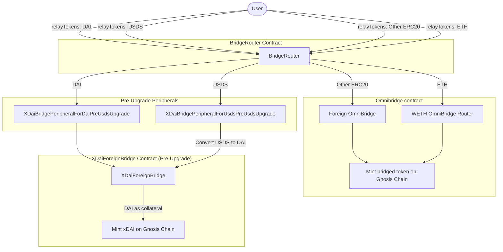
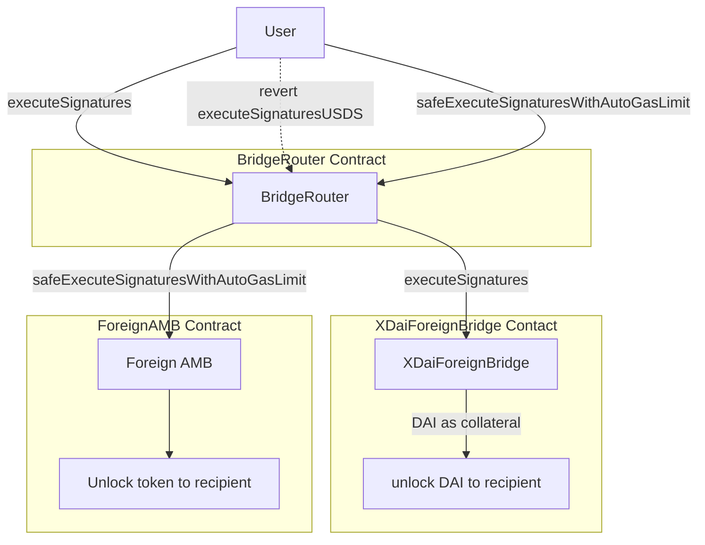
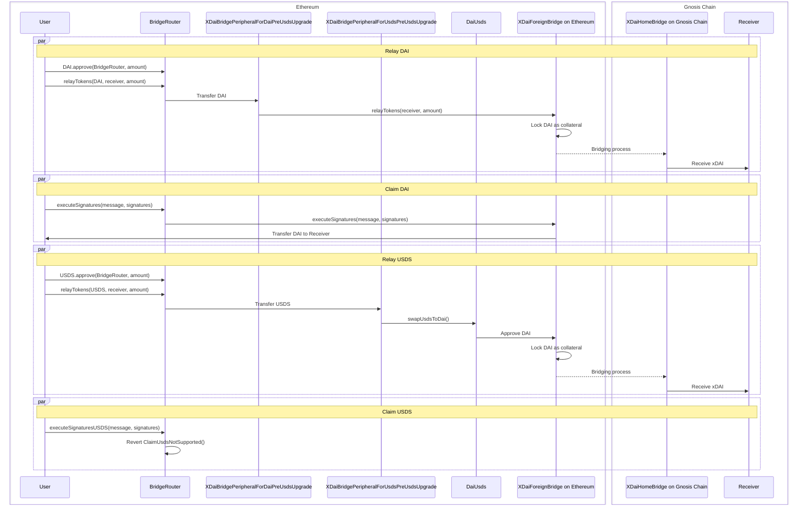
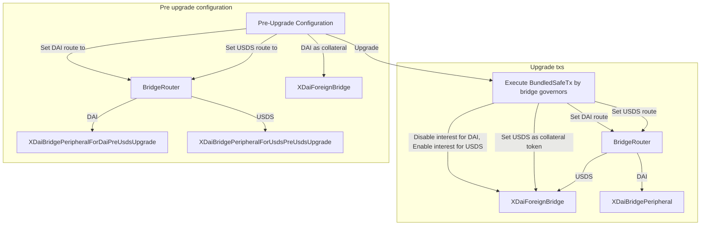
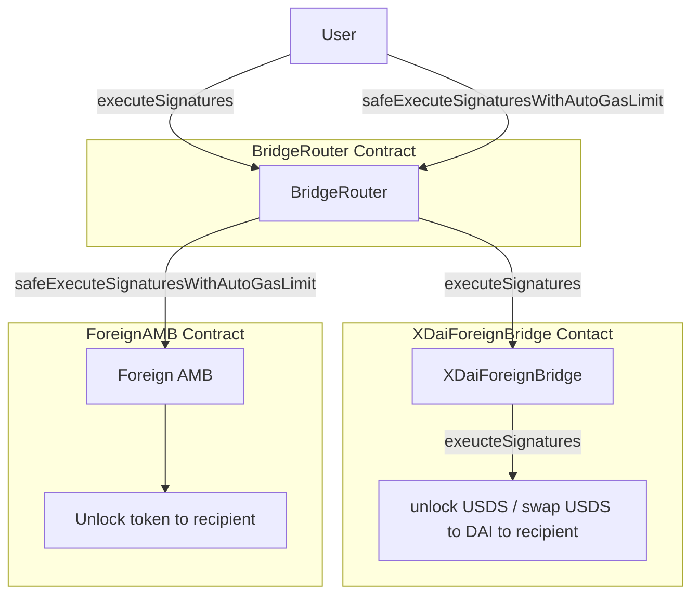
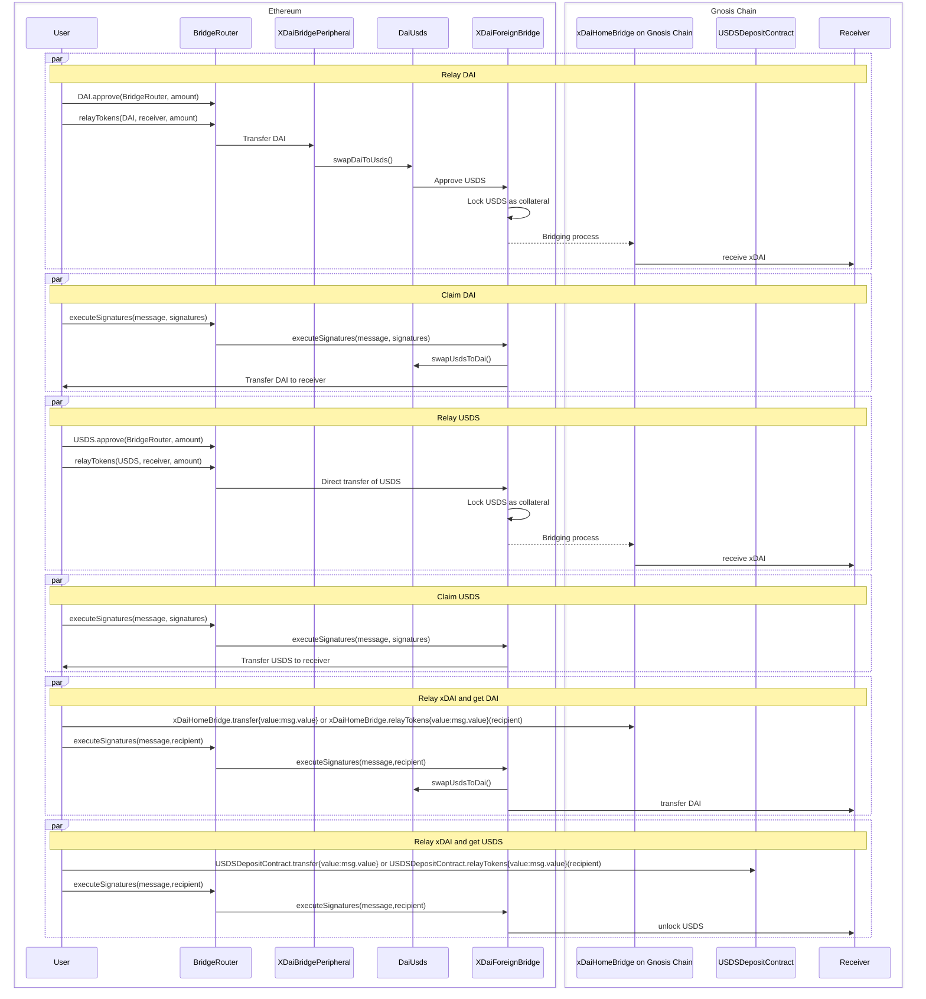

# USDS migration

> > After the migration, xDAI Foreign Bridge take USDS as collateral instead of DAI.  
> > Background: https://forum.gnosis.io/t/gip-118-should-sdai-be-replaced-by-susds-in-the-bridge/9354

> To address a potential front-running issue\* from the previous design, a new implementation has been introduced. The key changes includes:

1. New USDS deposit contract on Gnosis Chain
2. `token` parameter is introduced in the `UserRequestForSignature` event.
3. The `executeSignaturesUSDS` function is removed from the BridgeRouter and XdaiForeignBridge contract.

Target audiences:

1. 3rd party applications: please refer to [Call To Action](#call-to-action-update-your-code).
2. User: No action required.
3. Bridge validator: update the validator image to [v3.10.0](https://hub.docker.com/layers/gnosischain/tokenbridge-oracle/v3.10.0/images/sha256-f135fbec56c3755d40ebf68257bfab4258c80242566ed157a49e1e5cfc692c91).

\*refer to Omega audit XDFB1.

## Table of Contents

- [General Overview](#general-overview)
- [Dev](#dev)
- [Contracts overview](#contracts)
- [Interact with contracts](#interact-with-the-contracts)
- [Call to Action: Update your code](#call-to-action-update-your-code--indexer)
- [Test with post migration environment](#how-to-test-with-post-migration-environment)
- [Note for Bridge governors](#note-for-bridge-governors)

## General overview

1.  The **xDAI bridge contract** is undergoing a critical upgrade: **DAI will be replaced with USDS as the default accepted token on Ethereum, while xDAI will continue to be minted on Gnosis Chain**.

### Key Changes for Third-Party Applications:

Etherum -> Gnosis Chain

- Third-party applications **must integrate** with the new **Bridge Router contract on Ethereum**.
- The **Bridge Router** serves as the entry point for token relay transactions, routing them to the appropriate bridge contract on Gnosis Chain (**xDAI Bridge** or **Omnibridge**).
- **DAI & USDS transactions must go through the Bridge Router.** Transactions sent directly to the xDAI Bridge on Ethereum will **fail** if they attempt to relay DAI after the upgrade, but they will succeed in relaying USDS provided the sender has approved USDS for the bridge (\*Check [Edge Case](#edge-case))
- **For tokens other than DAI & USDS**, using the Bridge Router is **optional**—third-party applications can continue interacting with Omnibridge directly.

Gnosis Chain -> Ethereum

- To get USDS on Ethereum, one **MUST** switch to USDSDepositContract on Gnosis Chain when initiating the transaction.
- To get DAI on Ethereum, one **MUST** remain calling the Home xDAI Bridge as it is.
- Third-party applications **MUST** update their indexer to index the new event format emitted from Gnosis Chain.
- Claiming token on Ethereum remains the same function `executeSignatures(bytes memory message, bytes memory signatures)`. One can call it either on BridgeRouter or the XDaiForeignBridge contract on Ethereum.

### Transition Period:

- Before the USDS upgrade on the xDAI Bridge, third-party applications have time to **adapt to the Bridge Router interface, new USDS Deposit contract** and **update their indexer for new event signature on Gnosis Chain**.

## Dev

### Prerequisite

- [Node v10.18](https://nodejs.org/en/blog/release/v10.18.0) (as specified in .[nvm](https://github.com/nvm-sh/nvm)rc)
- [Foundry v0.2.0 or later](https://book.getfoundry.sh/getting-started/installation)
- Ethereum, Gnosis Chain RPC endpoint (for testing and deployment)

### Framework

[Foundry](https://book.getfoundry.sh/)

> > This repository was initially developed using [Truffle](https://archive.trufflesuite.com/docs/truffle/). However, due to the [sunsetting of Truffle](https://consensys.io/blog/consensys-announces-the-sunset-of-truffle-and-ganache-and-new-hardhat?utm_source=chatgpt.com), we transition our development workflow to Foundry.

### Setup

```sh
nvm use
npm i
forge install
forge build
```

### Test

```sh
source .env
chmod +x ./test/foundry/fork-test.sh && ./test/foundry/fork-test.sh
chmod +x ./test/foundry/e2e/e2e-test.sh && ./test/foundry/e2e/e2e-test.sh
```

For more details about testing, please check [this repository](https://github.com/gnosischain/xdaiBridge-usds-migration-test)

### Deploy

```sh
forge script script/Deploy.s.sol:Deploy --rpc-url $RPC_MAINNET --private-key $PRIVATE_KEY --verify --etherscan-api-key --broadcast
```

### Get deployed bytecode of the contract

```sh
npm run get-deployed-bytecode
```

The result will be written into `scripts/usds_migration/deployBytecode_usds_migration.json`.

### Get keccak256 hash of the contract

```sh
npm run get-contract-keccak256
```

The result will be written into `scripts/usds_migration/keccak256hash.json`.

| Contract                                  | Contract Hash (keccak256)                                            |
| ----------------------------------------- | -------------------------------------------------------------------- |
| xDaiForeignBridge                         | `0xbadd059fea2d7ab61bcd36db3418c6c73dca7a4fc02917ce5db2f78d962821f8` |
| BridgeRouter                              | `0xab729fba35c9d369445f85c3556db5644eb7356228ed3fda441bff4e7e1eacb8` |
| XDaiBridgePeripheral                      | `0x3d5e7ff9da196691d2dc57c93036c7414b68d63921dce530c5747017ea39afb5` |
| XDaiBridgePeripheralForDaiPreUsdsUpgrade  | `0x721cfb942f77f4b04de65a4dbb7b1686e2c363689c83de3bee58da3ab9ae0bb3` |
| XDaiBridgePeripheralForUsdsPreUsdsUpgrade | `0x74284da7c9b250a0348d431981364bf4e82987ca93524f2c392ea2455fd1e8a9` |
| HomeBridgeErcToNative                     | `0xb5a198416e6936a3443e718e53c675bf07621769bebb57b8c61389e740678f30` |
| USDSDepositContract                       | `0x347eaf2c91db18b5e5096a009b4a398daae84149a87bdf0cefa4545ea39b0f8c` |

For details about the keccak256 of the contract, please check [Sourcify's doc](https://docs.sourcify.dev/docs/full-vs-partial-match/#full-perfect-matches) and [Solidity's doc](https://docs.soliditylang.org/en/latest/metadata.html)

### Contract versions

| Contract                                      | Version                 | Optimizer Runs |
| --------------------------------------------- | ----------------------- | -------------- |
| BridgeRouter.sol                              | v0.8.25+commit.b61c2a91 | 10             |
| XDaiBridgePeripheral.sol                      | v0.8.25+commit.b61c2a91 | 10             |
| XDaiBridgePeripheralForDaiPreUsdsUpgrade.sol  | v0.8.25+commit.b61c2a91 | 10             |
| XDaiBridgePeripheralForUsdsPreUsdsUpgrade.sol | v0.8.25+commit.b61c2a91 | 10             |
| XDaiForeignBridge.sol                         | v0.4.24+commit.e67f0147 | 10             |
| HomeBridgeErcToNative.sol                     | v0.4.24+commit.e67f0147 | 10             |
| USDSDepositContract.sol                       | v0.8.25+commit.b61c2a91 | 10             |

# Contracts Overview

## New contracts

1. `BridgeRouter.sol`: An entry point for token transferring, abstracting relayTokens() for Omnibridge and xDAI bridge. Upgradeable with `TransparentUpgradeableProxy`.
2. `XDaiBridgePeripheral.sol`: Peripheral contract to convert between DAI and USDS after bridge migration.
3. `USDSDepositContract.sol`: Deposit contract to notify the bridge where the intended recieved token is USDS on Ethereum.

Transitional contracts during migration

1. `XDaiBridgePeripheralForDaiPreUsdsUpgrade.sol`: Allow `relayTokens` with DAI.

2. `XDaiBridgePeripheralForUsdsPreUsdsUpgrade.sol`: Allow `relayTokens` with USDS.

## Modified contracts

1. `SavingsDaiConnector.sol`: `daiToken()` address is changed to USDS address, `sDaiToken()` address is changed to sUSDS address.
2. `XDaiForeignBridge.sol`: new function introduced
   1. `swapSDAIToUSDS`: one time function for bridge migration
   2. Add token parameter in message parsing.
3. `HomeBridgeErcToNative.sol`: token parameter is included in event `UserRequestForSignature`, in `Message` library for parsing and encoding.
4. `HomeOverdrawManagement.sol`: add token parameter in `fixAssetsAboveLimits` function.
5. `ErcToNativeBridgeHelper.sol`: add token parameter to `getMessageHash` function.

## Audits

> > Original audit reports from the previous design.

1. [Omega](https://github.com/OmegaAudits/audits/blob/main/202510-Gnosis-Bridge-USDS-Upgrade.pdf)
2. Gnosis Ltd [1](./docs/audits/xdai-bridge-usds-upgrade-gnosis.pdf),[2](https://github.com/cducrest/audit-reports/blob/main/bridge-USDS-upgrade3.pdf)

### Contract addresses

| Contract                                   | Chain        | Address                                      |
| ------------------------------------------ | ------------ | -------------------------------------------- |
| BridgeRouter Proxy                         | Ethereum     | `0x9a873656c19Efecbfb4f9FAb5B7acdeAb466a0B0` |
| BridgeRouter Implementation                | Ethereum     | `0x74899961224538E423eFfD1A0Ff3346adf3F4C56` |
| XDaiBridgePeripheral                       | Ethereum     | `0x3b6669727927b934753B018EB421a84Ed4eb0a43` |
| XDaiBridgePeripheralForDaiPreUsdsUpgrade   | Ethereum     | `0xF676cc15Eb6d15b794aeC65bC20052aFB53D9052` |
| XDaiBridgePeripheralForUsdsPreUsdsUpgrade  | Ethereum     | `0x7df0e6a8BA609A6cC3Ab2fA33D953a3B5584f10C` |
| XDaiForeignBridge(Implementation Contract) | Ethereum     | `0x257bDD093Cab1Bd39eBF837dCB60f33d031d7d49` |
| HomeBridgeErcToNative Implementation       | Gnosis Chain | `0xe6998b0C03D3cb9ee8C04f266e573c7Fa8782846` |
| USDSDepositContract.sol                    | Gnosis Chain | `0x5C183C8A49aBA6e31049997a56D75600E27FF8c9` |
| Erc20ToNativeBridgeHelper.sol              | Gnosis Chain | `0xe30269bc61E677cD60aD163a221e464B7022fbf5` |

# Interacting with the contracts

## Before the xDAI Bridge migration

**Bridge Router setup**  
Caller: BridgeRouterOwner `0x42F38ec5A75acCEc50054671233dfAC9C0E7A3F6` (same as the bridge owner)

```
router.setRoute(DAI,address(XDaiBridgePeripheralForDaiPreUsdsUpgrade));
router.setRoute(USDS,address(XDaiBridgePeripheralForUsdsPreUsdsUpgrade));
```

### Relay tokens from Ethereum



### To claim token on Ethereum



1. `BridgeRouter.relayTokens(address token, address recipient, uint256 amount)`  
   -> When token is DAI / USDS from Ethereum, receive xDAI on GC.  
   -> When token is other tokens from Ethereum, receive the bridged version token on GC.
2. `BridgeRouter.executeSignatures(bytes memory message, bytes memory signatures)`  
   -> claim DAI on Ethereum
3. `BridgeRouter.executeSignaturesUSDS(bytes memory message, bytes memory signatures)`  
   -> revert `ClaimUsdsNotSupported()`
4. `BridgeRouter.safeExecuteSignaturesWithAutoGasLimit(bytes memory message, bytes memory signatures)`  
   -> claim token from Omnibridge
5. `xDAIForeignBridge.relayTokens(address recipient, uint256 amount)`  
   -> relay DAI from Ethereum, receive xDAI on GC
6. `xDAIForeignBridge.executeSignatures(bytes memory message, bytes memory signatures)`  
   -> claim DAI on Ethereum

### Function Callflow



**Relay DAI**

1. DAI.approve(BridgeRouter, amount)  
   -> [BridgeRouter.relayTokens(DAI, receiver, amount)](./contracts/upgradeable_contracts/erc20_to_native/BridgeRouter.sol#L37)  
   -> [XDaiBridgePeripheralForDaiPreUsdsUpgrade.relayTokens(receiver, amount)](./contracts/upgradeable_contracts/erc20_to_native/XDaiBridgePeripheralForDaiPreUsdsUpgrade.sol#L34)  
   -> [xDAIForeignBridge.relayTokens(receiver, amount)](./contracts/upgradeable_contracts/erc20_to_native/ForeignBridgeErcToNative.sol#L66)

**Claim DAI**

1. [BridgeRouter.executeSignatures(message, signatures)](./contracts/upgradeable_contracts/erc20_to_native/BridgeRouter.sol#L77)  
   -> [xDAIForeignBridge.executeSignatures(message, signatures)](./contracts/upgradeable_contracts/BasicForeignBridge.sol#L22)  
   -> (internal) [onExecuteMessage](./contracts/upgradeable_contracts/erc20_to_native/XDaiForeignBridge.sol#L123) |Here is where the DAI is transferred

**Relay USDS**

1. USDS.approve(BridgeRouter, amount)  
   -> [BridgeRouter.relayTokens(USDS, receiver, amount)](./contracts/upgradeable_contracts/erc20_to_native/BridgeRouter.sol#L37)  
   -> [XDaiBridgePeripheralForUsdsPreUsdsUpgrade.relayTokens(receiver, amount)](./contracts/upgradeable_contracts/erc20_to_native/XDaiBridgePeripheralForUsdsPreUsdsUpgrade.sol#L36) |Here is where USDS is swap to DAI  
   -> [xDAIForeignBridge.relayTokens(receiver, amount)](./contracts/upgradeable_contracts/erc20_to_native/ForeignBridgeErcToNative.sol#L66)

**Claim USDS**

1. [BridgeRouter.executeSignaturesUSDS(message,signatures)](./contracts/upgradeable_contracts/erc20_to_native/BridgeRouter.sol#L102)  
   -> revert `ClaimUsdsNotSupported()` `0x662554fc43b5d87090a5f9e8b365ca35213d23ae7082671886b760dc510ee8da`

XDaiForeignBridge's current implementation: https://etherscan.io/address/0x166124b75c798cedf1b43655e9b5284ebd5203db  
Code: https://github.com/gnosischain/tokenbridge-contracts/tree/xdaibridge/contracts/upgradeable_contracts/erc20_to_native

## Upgrade procedure



Test for the upgrade procedures is written in [BridgeRouter.t.sol#upgradeBridgeAndSetupRoute](./test/foundry/BridgeRouter.t.sol#L533)

### Function calls during the proxy upgrade

> > The function calls during the upgrade on BridgeProxy and Router is a bundled Safe transaction, that will be signed and executed by [bridge governors](https://docs.gnosischain.com/bridges/management/#bridge-governance).

**Call on bridge contracts**

ethereumXdaiBridgeProxy=`0x4aa42145Aa6Ebf72e164C9bBC74fbD3788045016`  
gnosisChainXdaiBridgeProxy = `0x7301CFA0e1756B71869E93d4e4Dca5c7d0eb0AA6`  
ethereumBridgeOwner= `0x42F38ec5A75acCEc50054671233dfAC9C0E7A3F6`  
gnosisChainBridgeOwner= `0x7a48Dac683DA91e4faa5aB13D91AB5fd170875bd`

- Ethereum

```solidity
   uint256 initialVersion = 9
   address newImpl = 0x257bDD093Cab1Bd39eBF837dCB60f33d031d7d49
   ethereumXdaiBridgeProxy.upgradeTo(initialVersion + 1, address(newImpl));

   // disable interested for DAI and swap sDAI -> sUSDS
   ethereumXdaiBridgeProxy.swapSDAIToUSDS();
   ethereumXdaiBridgeProxy.initializeInterest(
      address(USDS): 0xdC035D45d973E3EC169d2276DDab16f1e407384F,
      minCashThreshold: 1000000000000000000000000,
      minInterestPaid: 1000000000000000000000,
      gnosisInterestReceiver: 0x670daeaF0F1a5e336090504C68179670B5059088
   );
   ethereumXdaiBridgeProxy.invest(address(USDS));
```

- Gnosis Chain

```solidity
   uint256 initialVersion = 6
   address newImpl = 0xe6998b0C03D3cb9ee8C04f266e573c7Fa8782846
   address usdsDepositContract = 0x5C183C8A49aBA6e31049997a56D75600E27FF8c9
   gnosisChainXdaiBridgeProxy.upgradeTo(initialVersion + 1, address(newImpl))
   gnosisChainXdaiBridgeProxy.setUSDSDepositContract(usdsDepositContract);
```

**Upgrade BrigeRouter implementation and Update routes**

Caller: BridgeRouterOwner `0x42F38ec5A75acCEc50054671233dfAC9C0E7A3F6` (same as the bridge owner)

ROUTER_PROXY_ADDRESS=`0x9a873656c19Efecbfb4f9FAb5B7acdeAb466a0B0`
ProxyAdminContract=`0xD7e65A32bEd4ce8cc57Ec188F2bBb8016dc4b1cd`
XDAI_BRIDGE_PERIPHERAL=`0x3b6669727927b934753B018EB421a84Ed4eb0a43`
XDAI_FOREIGNBRIDGE_PROXY=`0x4aa42145Aa6Ebf72e164C9bBC74fbD3788045016`

```solidity
proxyAdminContract.upgradeAndCall(ROUTER_PROXY_ADDRESS,newImplementation, "");
router.setRoute(address(DAI), address(xDAIBridgeperipheral));
router.setRoute(address(USDS), xDAIForeignBridgeProxy);
```

## After the upgrade

### Relay token from Ethereum


### Relay xDAI from Gnosis Chain


### To claim token on Ethereum



1. `BridgeRouter.relayTokens(address token, address recipient, uint256 amount)`  
   -> When token is DAI / USDS from Ethereum, receive xDAI on GC.  
   -> When token is other tokens from Ethereum, receive the bridged version token on GC through Omnibridge.
2. `BridgeRouter.executeSignatures(bytes memory message, bytes memory signatures)`  
   -> Call xDAIForeignBridge.executeSignatures
3. `BridgeRouter.safeExecuteSignaturesWithAutoGasLimit(bytes memory message, bytes memory signatures)`  
   -> claim token from Omnibridge
4. `xDAIForeignBridge.relayTokens(address recipient, uint256 amount)`  
   -> relay USDS from Ethereum, receive xDAI on GC
5. `xDAIForeignBridge.executeSignatures(bytes memory message, bytes memory signatures)`  
   -> claim USDS / swap USDS->DAI on Ethereum

### Function Callflow



**Relay DAI**

1. DAI.approve(BridgeRouter, amount)  
   -> [BridgeRouter.relayTokens(DAI, receiver, amount)](./contracts/upgradeable_contracts/erc20_to_native/BridgeRouter.sol#L37)  
   -> [XDaiBridgePeripheral.relayTokens(receiver, amount)](./contracts/upgradeable_contracts/erc20_to_native/XDaiBridgePeripheral.sol#L35)  
   -> [xDAIForeignBridge.relayTokens(receiver, amount)](./contracts/upgradeable_contracts/erc20_to_native/ForeignBridgeErcToNative.sol#L66)

**Claim DAI**

1. [BridgeRouter.executeSignatures(message, signatures)](./contracts/upgradeable_contracts/erc20_to_native/BridgeRouter.sol#L77)  
   -> [xDAIForeignBridge.executeSignatures(message, signatures)](./contracts/upgradeable_contracts/BasicForeignBridge.sol#L22)  
   -> (internal)[onExecuteMessage](./contracts/upgradeable_contracts/erc20_to_native/XDaiForeignBridge.sol#L123) |Here is where USDS is swap to DAI

**Relay USDS**

1. USDS.approve(bridgeRouter, amount)  
   -> [BridgeRouter.relayTokens(USDS, receiver, amount)](./contracts/upgradeable_contracts/erc20_to_native/BridgeRouter.sol#L37)  
   -> [xDAIForeignBridge.relayTokens(receiver, amount)](./contracts/upgradeable_contracts/erc20_to_native/ForeignBridgeErcToNative.sol#L66)

**Claim USDS**

1. [BridgeRouter.executeSignatures(message, signatures)](./contracts/upgradeable_contracts/erc20_to_native/BridgeRouter.sol#L77)  
   -> [xDAIForeignBridge.executeSignatures(message,signatures)](./contracts/upgradeable_contracts/BasicForeignBridge.sol#L22) -> (internal)[onExecuteMessage](./contracts/upgradeable_contracts/erc20_to_native/XDaiForeignBridge.sol#L123) |Here is where USDS is swap to DAI

**Relay xDAI and get DAI**

1. [xDAIHomeBridge.transfer{value: msg.value}("")](./contracts/upgradeable_contracts/erc20_to_native/HomeBridgeErcToNative.sol#L28) or [xDAIHomeBridge.relayTokens{value: msg.value}(address recipient)](./contracts/upgradeable_contracts/erc20_to_native/HomeBridgeErcToNative.sol#L67)

**Relay xDAI and get USDS**

1. [USDSDepositContract.transfer{value: msg.value}("")](./contracts/USDSDepositContract.sol#L13) or [USDSDepositContract.relayTokens{value: msg.value}(address recipient)](./contracts/USDSDepositContract.sol#L17)

### Edge case

1. After the upgrade, the xDAI Foreign Bridge assumes the sender wants to relay USDS.

   - If a user intends to relay DAI, but still has an existing USDS allowance for the bridge, the bridge will use the USDS allowance and relay USDS instead of DAI.

   - To avoid unintended relays:

     - Always interact with the Bridge Router when relaying DAI.

     - Approve only the exact amount of USDS you intend to relay, rather than leaving a large allowance.

### Note on BridgeRouter.sol

BridgeRouter.sol uses TransparentUpgradeableProxy from Openzeppelin as proxy.

1. TransparentUpgradeableProxy.sol is deployed from [Openzeppelin/openzeppelin-contract@acd4ff7](https://github.com/OpenZeppelin/openzeppelin-contracts/tree/acd4ff74de833399287ed6b31b4debf6b2b35527) v5.2.0. Audited in [2024-10-v5.1.pdf](https://github.com/OpenZeppelin/openzeppelin-contracts/blob/master/audits/2024-10-v5.1.pdf)

2. ProxyAdmibn.sol is deployed from [Openzeppelin/openzeppelin-contract@acd4ff7](https://github.com/OpenZeppelin/openzeppelin-contracts/tree/acd4ff74de833399287ed6b31b4debf6b2b35527) v5.2.0. Audited in [2023-10-v5.0.pdf](https://github.com/OpenZeppelin/openzeppelin-contracts/blob/master/audits/2023-10-v5.0.pdf)

To verify deployed bytecode, checkout [this repository](https://github.com/zengzengzenghuy/USDS-migration-xDAIBridge-contract-verification)

# Call to Action: Update your code & indexer

To modify your existing smart contract code to work with the xDAI bridge after USDS migration, complete the following changes:

## Contract Interface

Ethereum -> Gnosis Chain

### Relay tokens

```solidity
  >>> Previous
  xDAIForeignBridge.relayTokens(address recipient, uint256 value)

  <<< Latest
   BridgeRouter.relayTokens(address token, address recipient, uint256 value)
```

### Claim tokens

```solidity
  >>> Previous
  xDAIForeignBridge.executeSignatures(bytes message, bytes signatures)

  <<< Latest
   BridgeRouter.executeSignatures(bytes message, bytes signatures)
```

Gnosis Chain -> Ethereum

### Relay tokens

```solidity
  >>> Previous
  HomeBridgeErcToNative.relayTokens{value: msg.value}(address recipient)
  HomeBridgeErcToNative.call{value: msg.value}("")

  <<< Latest
  // To get DAI on Ethereum
  HomeBridgeErcToNative.relayTokens{value: msg.value}(address recipient)
  // To get DAI on Ethereum
  HomeBridgeErcToNative.call{value: msg.value}("")
  // To get USDS on Ethereum
  USDSDepositContract.relayTokens{value: msg.value}(address recipient)
  // To get USDS on Ethereum
  USDSDepositContract.call{value: msg.value}("")
```

## Event signature

```solidity
    >>> Previous
    // 0xbcb4ebd89690a7455d6ec096a6bfc4a8a891ac741ffe4e678ea2614853248658
    event UserRequestForSignature(address recipient, uint256 value, bytes32 nonce);

    <<< Latest
    // 0xe1e0bc4a1db39a361e3589cae613d7b4862e1f9114dd3ff12ff45be395046968
    event UserRequestForSignature(address recipient, uint256 value, bytes32 nonce, address token);
```

# Glossary

1. **BridgeRouter**: Entry point contract after the migration on Ethereum, facilitating routing and token swapping.
2. **xDAIForeignBridge**: xDAI bridge on Ethereum.
3. **HomeBridgeErcToNative** / **xDAI Home Bridge**: xDAI bridge on Gnosis Chain.
4. **USDSDepositContract**: Deposit contract on Gnosis Chain that acts as an entry point contract if user wants to receive USDS on Ethereum.
5. **Foreign Chain**: Ethereum
6. **Home Chain**: Gnosis Chain

# How to test with post migration environment

To simulate the actual mainnet environment, we use [Tenderly Virtual TestNets](https://tenderly.co/virtual-testnets) for both Ethereum and Gnosis Chain. Third-party applications are encouraged to use the following RPC endpoints to simulate the post-migration environment.

**Switch your RPC**:

1. Ethereum: https://virtual.mainnet.eu.rpc.tenderly.co/f3e5e498-bd28-4b49-a8f6-93f033e6fa6e

   - Explorer: https://dashboard.tenderly.co/explorer/vnet/f3e5e498-bd28-4b49-a8f6-93f033e6fa6e

2. Gnosis Chain: https://virtual.gnosis.eu.rpc.tenderly.co/4c9e4122-6c01-46bd-a44a-e08133d2d2cc

   - Explorer: https://dashboard.tenderly.co/explorer/vnet/4c9e4122-6c01-46bd-a44a-e08133d2d2cc

# Note for bridge governors

For call traces, state changes, emitted event, touched contracts, please check:

1. Tenderly Simulation on Ethereum: https://dashboard.tenderly.co/public/safe/safe-apps/simulator/7a369788-8c38-4ace-b7ed-1f25981e8bee
2. Tenderly Simulation on Gnosis Chain: https://dashboard.tenderly.co/public/safe/safe-apps/simulator/3940609f-bcf2-4428-9432-11a4c98ccd73

**Core contract in the upgrade**

1. XDaiForeignBridge.sol: `0x257bDD093Cab1Bd39eBF837dCB60f33d031d7d49`
2. HomeBridgeErcToNative.sol: `0xe6998b0C03D3cb9ee8C04f266e573c7Fa8782846`
3. USDSDepositContract.sol: `0x5C183C8A49aBA6e31049997a56D75600E27FF8c9`

**Peripheral contract in the upgrade**

1. BridgeRouter.sol: `0x74899961224538E423eFfD1A0Ff3346adf3F4C56`
2. TransparentUpgradeableProxy.sol: `0x9a873656c19Efecbfb4f9FAb5B7acdeAb466a0B0`
3. ProxyAdmin.sol: `0xD7e65A32bEd4ce8cc57Ec188F2bBb8016dc4b1cd`
4. XDaiBridgePeripheral.sol: `0x3b6669727927b934753B018EB421a84Ed4eb0a43`

**Contract & parameters mentioned in the upgrade transaction**

1. `0x257bDD093Cab1Bd39eBF837dCB60f33d031d7d49`(Ethereum): XDaiForeignBridge new implementation
2. `0xe6998b0C03D3cb9ee8C04f266e573c7Fa8782846`(Ethereum): HomeBridgeErcToNative new implementation
3. `0x5C183C8A49aBA6e31049997a56D75600E27FF8c9`(Gnosis Chain): USDSDepositContract
4. `0x74899961224538E423eFfD1A0Ff3346adf3F4C56`(Ethereum): BridgeRouter new implementaiton
5. `0x9a873656c19Efecbfb4f9FAb5B7acdeAb466a0B0`(Ethereum): TransparentUpgradeableProxy for BridgeRouter
6. `0xD7e65A32bEd4ce8cc57Ec188F2bBb8016dc4b1cd`(Ethereum): ProxyAdmin.sol for BridgeRouter, controls upgrade for the implementation contract w.r.t Proxy address
7. `0x3b6669727927b934753B018EB421a84Ed4eb0a43`(Ethereum): XDaiBridgePeripheral, swap DAI->USDS for user before bridging
8. `0x4aa42145aa6ebf72e164c9bbc74fbd3788045016`(Ethereum): XDaiForeignBridgeProxy
9. `0x7301CFA0e1756B71869E93d4e4Dca5c7d0eb0AA6`(GnosisChain): HomeBridgErcToNativeProxy
10. `0x670daeaF0F1a5e336090504C68179670B5059088`(GnosisChain): InterestReceiver contract when `payInterest` is called. Related to sDAI yield when sDAI adapter `claim` function is [called](https://gnosisscan.io/address/0x670daeaf0f1a5e336090504c68179670b5059088#tokentxns)
11. `0x6B175474E89094C44Da98b954EedeAC495271d0F`(Ethereum): DAI token address
12. `0xdC035D45d973E3EC169d2276DDab16f1e407384F`(Ethereum): USDS token address
13. `minCashThreshold`: is the minimum USDS that the bridge need to hold for user to claim USDS back. It acts as a buffer and the minCashThreshold amount is not used for investing. Value: `1000000000000000000000000`. (Same as [`minCashThreshold(DAI)`](:https://etherscan.io/address/0x4aa42145Aa6Ebf72e164C9bBC74fbD3788045016#readProxyContract#F14))
14. `minInterestPaid`: The minimum amount of interest from sUSDS that can be withdrawn during a payInterest call. The payInterest call will be invalid if the available interest < minInterestedPaid. Value: `1000000000000000000000`. (Same as [`minInterestedPaid(DAI)`](https://etherscan.io/address/0x4aa42145Aa6Ebf72e164C9bBC74fbD3788045016#readProxyContract#F11))

**Technical Analysis**

We have requested Omega team to audit and verify the Safe transaction payload of the upgrade txs on both Ethereum and Gnosis Chain. The upgrade txs are consistent with the description on both this technical documentation and the governance forum.

Upgrade tx on Ethereum: [url](https://app.safe.global/transactions/tx?safe=eth:0x42F38ec5A75acCEc50054671233dfAC9C0E7A3F6&id=multisig_0x42F38ec5A75acCEc50054671233dfAC9C0E7A3F6_0x7309151c47d50ea0bac9eac0b28a13b8c2904857d7ddd6c65653336d9b53acc0)  
Upgrade tx on Gnosis Chain: [url](https://app.safe.global/transactions/tx?safe=gno:0x7a48Dac683DA91e4faa5aB13D91AB5fd170875bd&id=multisig_0x7a48Dac683DA91e4faa5aB13D91AB5fd170875bd_0xb6d709f3f6fe73958bf4de18a2d8ba81b8981a18e0c17c9f608e61c03ec0e166)

Omega validations

- [x] The deployed bytecode of the deployed contracts match the deployed bytecode of the contracts audited by Omega.
- [x] The parameters and state changes of the transactions match the intented upgrade behaviors
- [x] The signatures in Bridge governors Safe correspond with the SafeTxHash and signatures of the Safe.

Both transactions are executed on Nov 7 2025.
