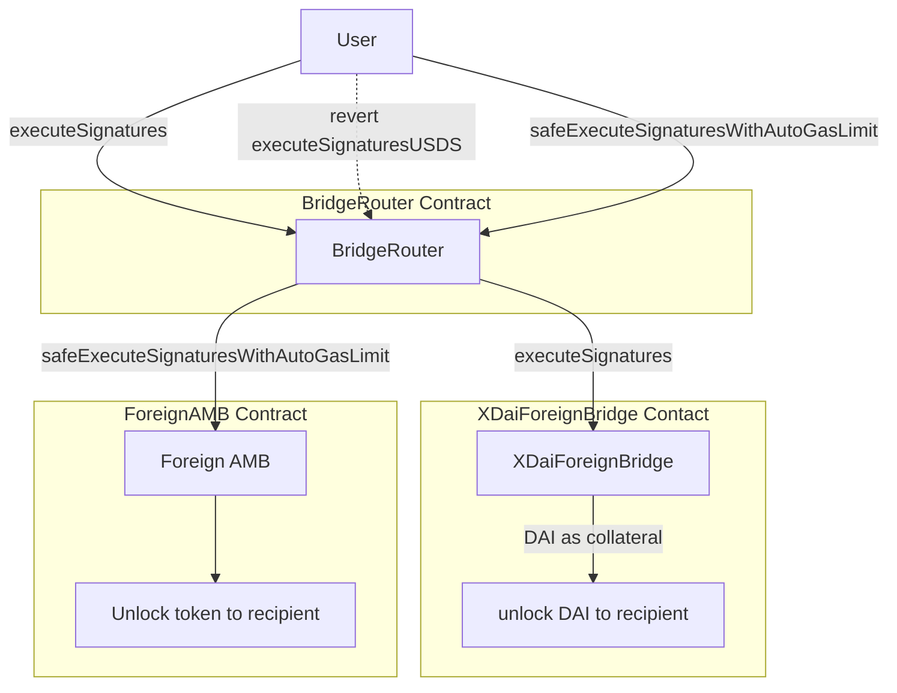
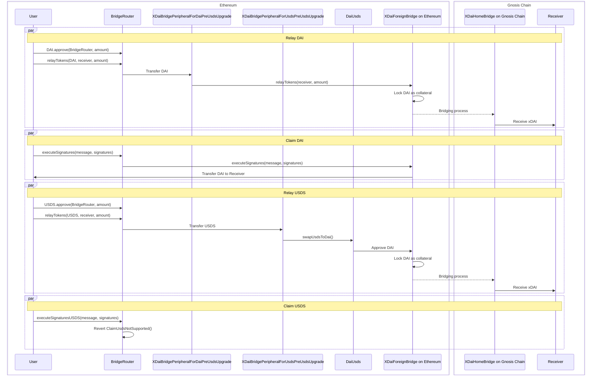
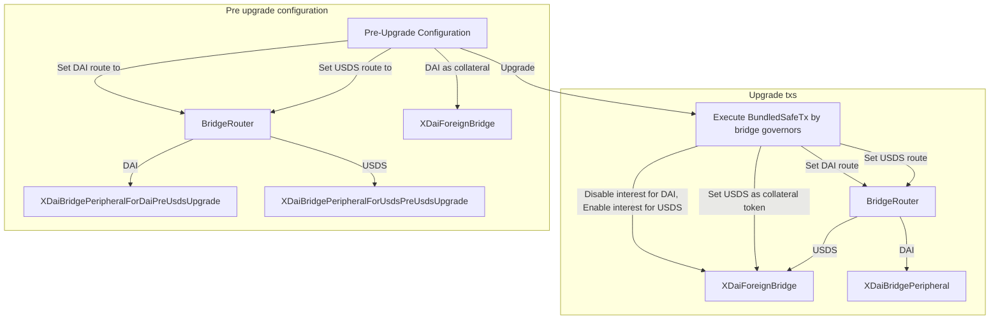
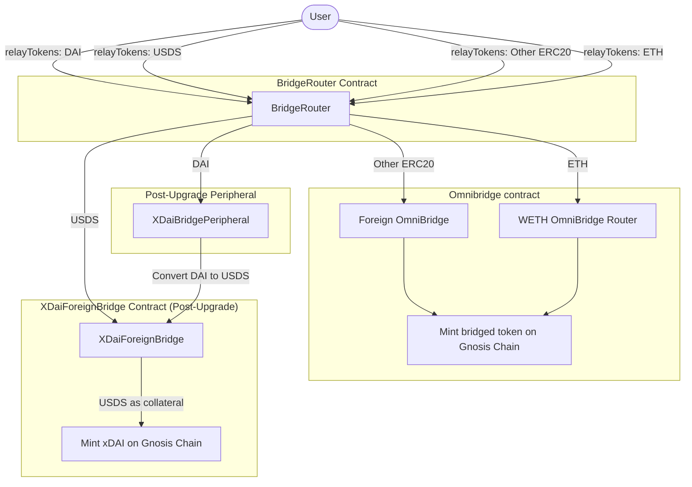
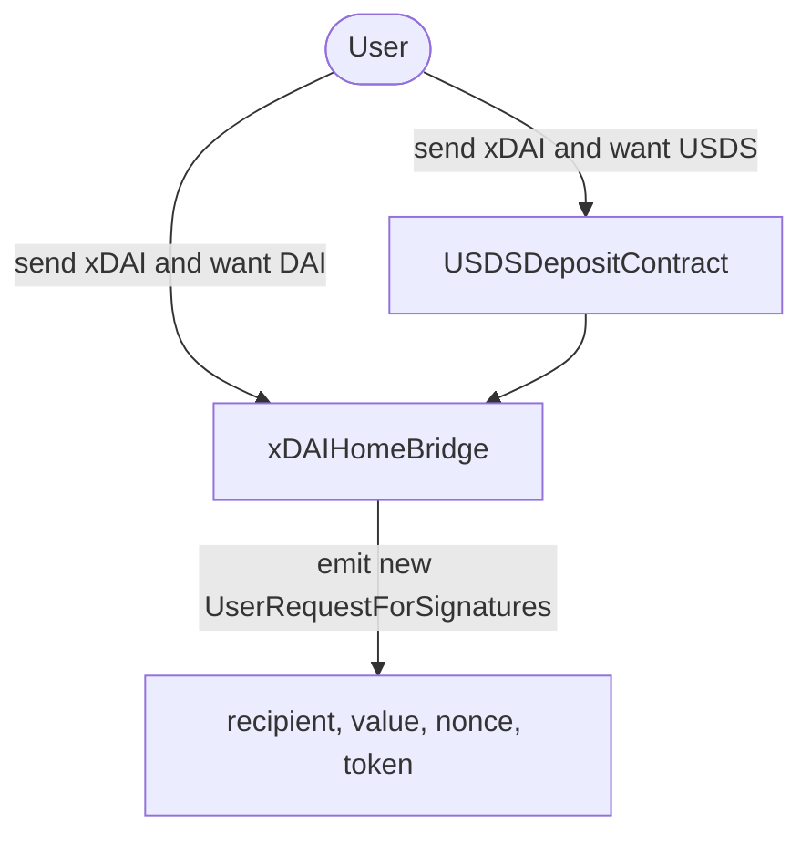
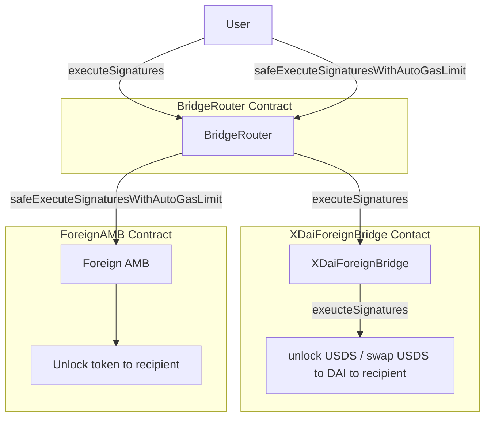
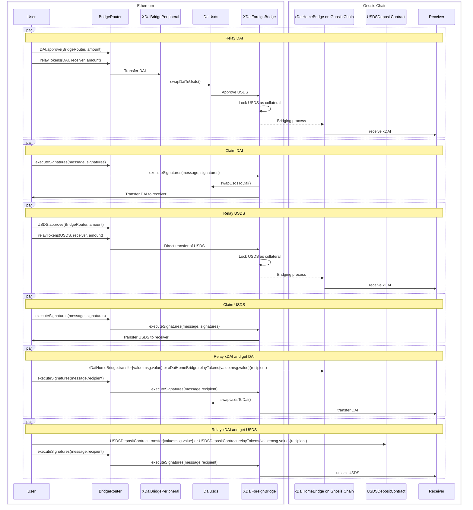

# USDS migration

> > After the migration, xDAI Foreign Bridge take USDS as collateral instead of DAI.  
> > Background: https://forum.gnosis.io/t/gip-118-should-sdai-be-replaced-by-susds-in-the-bridge/9354

> To address a potential front-running issue\* from the previous design, a new implementation has been introduced. The key changes includes:

1. New USDS deposit contract on Gnosis Chain
2. `token` parameter is introduced in the `UserRequestForSignatures` event.
3. The `executeSignaturesUSDS` function is removed from the BridgeRouter and XdaiForeignBridge contract.

Target audiences:

1. 3rd party applications: please refer to [Call To Action](#call-to-action-update-your-code).
2. User: No action required.
3. Bridge validator: update the validator image to latest version(WIP).

\*refer to Omega audit XDFB1.

## Table of Contents

- [General Overview](#general-overview)
- [Dev](#dev)
- [Contracts overview](#contracts)
- [Interact with contracts](#interact-with-the-contracts)
- [Call to Action: Update your code](#call-to-action-update-your-code)
- [Test with post migration environment](#how-to-test-with-post-migration-environment)

## General overview

1.  The **xDAI bridge contract** is undergoing a critical upgrade: **DAI will be replaced with USDS as the default accepted token on Ethereum, while xDAI will continue to be minted on Gnosis Chain**.

### Key Changes for Third-Party Applications:

Etherum -> Gnosis Chain

- Third-party applications **must integrate** with the new **Bridge Router contract on Ethereum**.
- The **Bridge Router** serves as the entry point for token relay transactions, routing them to the appropriate bridge contract on Gnosis Chain (**xDAI Bridge** or **Omnibridge**).
- **DAI & USDS transactions must go through the Bridge Router.** Transactions sent directly to the xDAI Bridge on Ethereum will **fail** if they attempt to relay DAI after the upgrade, but they will succeed in relaying USDS provided the sender has approved USDS for the bridge (\*Check [Edge Case](#edge-case))
- **For tokens other than DAI & USDS**, using the Bridge Router is **optional**—third-party applications can continue interacting with Omnibridge directly.

Gnosis Chain -> Ethereum

- To get USDS on Ethereum, one **MUST** switch to USDSDepositContract on Gnosis Chain when initiating the transaction.
- To get DAI on Ethereum, one **MUST** remain calling the Home xDAI Bridge as it is.
- Third-party applications **MUST** update their indexer to index the new event format emitted from Gnosis Chain.
- Claiming token on Ethereum remains the same function `executeSignatures(bytes memory message, bytes memory signatures)`. One can call it either on BridgeRouter or the XDaiForeignBridge contract on Ethereum.

### Transition Period:

- Before the USDS upgrade on the xDAI Bridge, third-party applications have time to **adapt to the Bridge Router interface, new USDS Deposit contract** and **update their indexer for new event signature on Gnosis Chain**.

## Dev

### Prerequisite

- [Node v10.18](https://nodejs.org/en/blog/release/v10.18.0) (as specified in .[nvm](https://github.com/nvm-sh/nvm)rc)
- [Foundry v0.2.0 or later](https://book.getfoundry.sh/getting-started/installation)
- Ethereum, Gnosis Chain RPC endpoint (for testing and deployment)

### Framework

[Foundry](https://book.getfoundry.sh/)

> > This repository was initially developed using [Truffle](https://archive.trufflesuite.com/docs/truffle/). However, due to the [sunsetting of Truffle](https://consensys.io/blog/consensys-announces-the-sunset-of-truffle-and-ganache-and-new-hardhat?utm_source=chatgpt.com), we transition our development workflow to Foundry.

### Setup

```sh
nvm use
npm i
forge install
forge build
```

### Test

```sh
source .env
chmod +x ./test/foundry/fork-test.sh && ./test/foundry/fork-test.sh
chmod +x ./test/foundry/e2e/e2e-test.sh && ./test/foundry/e2e/e2e-test.sh
```

For more details about testing, please check [this repository](https://github.com/gnosischain/xdaiBridge-usds-migration-test)

### Deploy

```sh
forge script script/Deploy.s.sol:Deploy --rpc-url $RPC_MAINNET --private-key $PRIVATE_KEY --verify --etherscan-api-key --broadcast
```

### Get deployed bytecode of the contract

```sh
npm run get-deployed-bytecode
```

The result will be written into `scripts/usds_migration/deployBytecode_usds_migration.json`.

### Get keccak256 hash of the contract

```sh
npm run get-contract-keccak256
```

The result will be written into `scripts/usds_migration/keccak256hash.json`.

| Contract                                  | Contract Hash (keccak256) |
| ----------------------------------------- | ------------------------- |
| xDaiForeignBridge                         |                           |
| BridgeRouter                              |                           |
| XDaiBridgePeripheral                      |                           |
| XDaiBridgePeripheralForDaiPreUsdsUpgrade  |                           |
| XDaiBridgePeripheralForUsdsPreUsdsUpgrade |                           |
| HomeErcToNative                           |                           |
| USDSDepositContract                       |                           |

For details about the keccak256 of the contract, please check [Sourcify's doc](https://docs.sourcify.dev/docs/full-vs-partial-match/#full-perfect-matches) and [Solidity's doc](https://docs.soliditylang.org/en/latest/metadata.html)

### Contract versions

| Contract                                      | Version                 | Optimizer Runs |
| --------------------------------------------- | ----------------------- | -------------- |
| BridgeRouter.sol                              | v0.8.25+commit.b61c2a91 | 10             |
| XDaiBridgePeripheral.sol                      | v0.8.25+commit.b61c2a91 | 10             |
| XDaiBridgePeripheralForDaiPreUsdsUpgrade.sol  | v0.8.25+commit.b61c2a91 | 10             |
| XDaiBridgePeripheralForUsdsPreUsdsUpgrade.sol | v0.8.25+commit.b61c2a91 | 10             |
| XDaiForeignBridge.sol                         | v0.4.24+commit.e67f0147 | 10             |
| HomeErcToNative.sol                           | v0.4.24+commit.e67f0147 | 10             |
| USDSDepositContract.sol                       | v0.8.25+commit.b61c2a91 | 10             |

# Contracts Overview

## New contracts

1. `BridgeRouter.sol`: An entry point for token transferring, abstracting relayTokens() for Omnibridge and xDAI bridge. Upgradeable with `TransparentUpgradeableProxy`.
2. `XDaiBridgePeripheral.sol`: Peripheral contract to convert between DAI and USDS after bridge migration.
3. `USDSDepositContract.sol`: Deposit contract to notify the bridge where the intended recieved token is USDS on Ethereum.

Transitional contracts during migration

1. `XDaiBridgePeripheralForDaiPreUsdsUpgrade.sol`: Allow `relayTokens` with DAI.

2. `XDaiBridgePeripheralForUsdsPreUsdsUpgrade.sol`: Allow `relayTokens` with USDS.

## Modified contracts

1. `SavingsDaiConnector.sol`: `daiToken()` address is changed to USDS address, `sDaiToken()` address is changed to sUSDS address.
2. `XDaiForeignBridge.sol`: new function introduced
   1. `swapSDAIToUSDS`: one time function for bridge migration
   2. Add token parameter in message parsing.
3. `HomeErcToNative.sol`: token parameter is included in event `UserRequestForSignatures`, in `Message` library for parsing and encoding.
4. `HomeOverdrawManagement.sol`: add token parameter in `fixAssetsAboveLimits` function.
5. `ErcToNativeBridgeHelper.sol`: add token parameter to `getMessageHash` function.

## Audits

> > Original audit reports from the previous design.

1. [Omega](./docs/audits/xdai-bridge-usds-upgrade-omega.pdf)
2. [Gnosis Ltd](./docs/audits/xdai-bridge-usds-upgrade-gnosis.pdf)

### Contract addresses

| Contract                                   | Chain        | Address                                      |
| ------------------------------------------ | ------------ | -------------------------------------------- |
| BridgeRouter Proxy                         | Ethereum     | `0x9a873656c19Efecbfb4f9FAb5B7acdeAb466a0B0` |
| BridgeRouter Implementation                | Ethereum     | `0x691c025Efa7ea1c87DF256F2Da9208E5345D40b1` |
| XDaiBridgePeripheral                       | Ethereum     | `0x3b6669727927b934753B018EB421a84Ed4eb0a43` |
| XDaiBridgePeripheralForDaiPreUsdsUpgrade   | Ethereum     | `0xF676cc15Eb6d15b794aeC65bC20052aFB53D9052` |
| XDaiBridgePeripheralForUsdsPreUsdsUpgrade  | Ethereum     | `0x7df0e6a8BA609A6cC3Ab2fA33D953a3B5584f10C` |
| XDaiForeignBridge(Implementation Contract) | Ethereum     | `0x3AbD91b5564BaF7966DcA7a30Bd50EAcc9aBeD77` |
| HomeErcToNative.sol                        | Gnosis Chain |                                              |
| USDSDepositContract.sol                    | Gnosis Chain |                                              |

# Interacting with the contracts

## Before the xDAI Bridge migration

**Bridge Router setup**  
Caller: BridgeRouterOwner `0x42F38ec5A75acCEc50054671233dfAC9C0E7A3F6` (same as the bridge owner)

```
router.setRoute(DAI,address(XDaiBridgePeripheralForDaiPreUsdsUpgrade));
router.setRoute(USDS,address(XDaiBridgePeripheralForUsdsPreUsdsUpgrade));
```

### Relay tokens from Ethereum


### To claim token on Ethereum



1. `BridgeRouter.relayTokens(address token, address recipient, uint256 amount)`  
   -> When token is DAI / USDS from Ethereum, receive xDAI on GC.  
   -> When token is other tokens from Ethereum, receive the bridged version token on GC.
2. `BridgeRouter.executeSignatures(bytes memory message, bytes memory signatures)`  
   -> claim DAI on Ethereum
3. `BridgeRouter.executeSignaturesUSDS(bytes memory message, bytes memory signatures)`  
   -> revert `ClaimUsdsNotSupported()`
4. `BridgeRouter.safeExecuteSignaturesWithAutoGasLimit(bytes memory message, bytes memory signatures)`  
   -> claim token from Omnibridge
5. `xDAIForeignBridge.relayTokens(address recipient, uint256 amount)`  
   -> relay DAI from Ethereum, receive xDAI on GC
6. `xDAIForeignBridge.executeSignatures(bytes memory message, bytes memory signatures)`  
   -> claim DAI on Ethereum

### Function Callflow



**Relay DAI**

1. DAI.approve(BridgeRouter, amount)  
   -> [BridgeRouter.relayTokens(DAI, receiver, amount)](./contracts/upgradeable_contracts/erc20_to_native/BridgeRouter.sol#L44)  
   -> [XDaiBridgePeripheralForDaiPreUsdsUpgrade.relayTokens(receiver, amount)](./contracts/upgradeable_contracts/erc20_to_native/XDaiBridgePeripheralForDaiPreUsdsUpgrade.sol#L37)  
   -> [xDAIForeignBridge.relayTokens(receiver, amount)](./contracts/upgradeable_contracts/erc20_to_native/ForeignBridgeErcToNative.sol#L64)

**Claim DAI**

1. [BridgeRouter.executeSignatures(message, signatures)](./contracts/upgradeable_contracts/erc20_to_native/BridgeRouter.sol#L79)  
   -> [xDAIForeignBridge.executeSignatures(message, signatures)](./contracts/upgradeable_contracts/BasicForeignBridge.sol#L22)  
   -> (internal) [onExecuteMessage](./contracts/upgradeable_contracts/erc20_to_native/XDaiForeignBridge.sol#L151) |Here is where the DAI is transferred

**Relay USDS**

1. USDS.approve(BridgeRouter, amount)  
   -> [BridgeRouter.relayTokens(USDS, receiver, amount)](./contracts/upgradeable_contracts/erc20_to_native/BridgeRouter.sol#L47)  
   -> [XDaiBridgePeripheralForUsdsPreUsdsUpgrade.relayTokens(receiver, amount)](./contracts/upgradeable_contracts/erc20_to_native/XDaiBridgePeripheralForUsdsPreUsdsUpgrade.sol#L36) |Here is where USDS is swap to DAI  
   -> [xDAIForeignBridge.relayTokens(receiver, amount)](./contracts/upgradeable_contracts/erc20_to_native/ForeignBridgeErcToNative.sol#L64)

**Claim USDS**

1. [BridgeRouter.executeSignaturesUSDS(message,signatures)](./contracts/upgradeable_contracts/erc20_to_native/BridgeRouter.sol#L102)  
   -> revert `ClaimUsdsNotSupported()` `0x662554fc43b5d87090a5f9e8b365ca35213d23ae7082671886b760dc510ee8da`

XDaiForeignBridge's current implementation: https://etherscan.io/address/0x166124b75c798cedf1b43655e9b5284ebd5203db  
Code: https://github.com/gnosischain/tokenbridge-contracts/tree/xdaibridge/contracts/upgradeable_contracts/erc20_to_native

## Upgrade procedure



Test for the upgrade procedures is written in [BridgeRouter.t.sol#upgradeBridgeAndSetupRoute](./test/foundry/BridgeRouter.t.sol#L533)

### Function calls during the proxy upgrade

> > The function calls during the upgrade on BridgeProxy and Router is a bundled Safe transaction, that will be signed and executed by [bridge governors](https://docs.gnosischain.com/bridges/management/#bridge-governance).

**Call on bridge contracts**

ethereumXdaiBridgeProxy=`0x4aa42145Aa6Ebf72e164C9bBC74fbD3788045016`
gnosisChainXdaiBridgeProxy = `0x7301CFA0e1756B71869E93d4e4Dca5c7d0eb0AA6`
ethereumBridgeOwner= `0x42F38ec5A75acCEc50054671233dfAC9C0E7A3F6`
gnosisChainBridgeOwner= `0x7a48Dac683DA91e4faa5aB13D91AB5fd170875bd`

- Ethereum

```solidity
   uint256 initialVersion = 9
   address newImpl = 0x3AbD91b5564BaF7966DcA7a30Bd50EAcc9aBeD77
   ethereumXdaiBridgeProxy.upgradeTo(initialVersion + 1, address(newImpl));

   // disable interested for DAI and swap sDAI -> sUSDS
   ethereumXdaiBridgeProxy.swapSDAIToUSDS();
   ethereumXdaiBridgeProxy.initializeInterest(
      address(USDS): 0xdC035D45d973E3EC169d2276DDab16f1e407384F,
      minCashThreshold: 1000000000000000000000000,
      minInterestPaid: 1000000000000000000000,
      gnosisInterestReceiver: 0x670daeaF0F1a5e336090504C68179670B5059088
   );
   ethereumXdaiBridgeProxy.invest(address(USDS));
```

- Gnosis Chain

```solidity
   uint256 initialVersion = 6
   address newImpl = // TODO
   address usdsDepositContract = // TODO
   gnosisChainXdaiBridgeProxy.upgradeToAndcall(initialVersion + 1, address(newImpl), abi.encodeWithSignatures("setUSDSDepositContract(address)", usdsDepositContract));
```

**Upgrade BrigeRouter implementation and Update routes**

Caller: BridgeRouterOwner `0x42F38ec5A75acCEc50054671233dfAC9C0E7A3F6` (same as the bridge owner)

ROUTER_ADDRESS=0x9a873656c19Efecbfb4f9FAb5B7acdeAb466a0B0
ProxyAdminContract=0xD7e65A32bEd4ce8cc57Ec188F2bBb8016dc4b1cd
XDAI_BRIDGE_PERIPHERAL=0x3b6669727927b934753B018EB421a84Ed4eb0a43
XDAI_FOREIGNBRIDGE_PROXY=`0x4aa42145Aa6Ebf72e164C9bBC74fbD3788045016`

```solidity
proxyAdminContract.upgradeAndCall(ROUTER_ADDRESS,newImplementation, "");
router.setRoute(address(DAI), address(xDAIBridgeperipheral));
router.setRoute(address(USDS), xDAIForeignBridgeProxy);
```

## After the upgrade

### Relay token from Ethereum



### Relay xDAI from Gnosis Chain



### To claim token on Ethereum



1. `BridgeRouter.relayTokens(address token, address recipient, uint256 amount)`  
   -> When token is DAI / USDS from Ethereum, receive xDAI on GC.  
   -> When token is other tokens from Ethereum, receive the bridged version token on GC through Omnibridge.
2. `BridgeRouter.executeSignatures(bytes memory message, bytes memory signatures)`  
   -> Call xDAIForeignBridge.executeSignatures
3. `BridgeRouter.safeExecuteSignaturesWithAutoGasLimit(bytes memory message, bytes memory signatures)`  
   -> claim token from Omnibridge
4. `xDAIForeignBridge.relayTokens(address recipient, uint256 amount)`  
   -> relay USDS from Ethereum, receive xDAI on GC
5. `xDAIForeignBridge.executeSignatures(bytes memory message, bytes memory signatures)`  
   -> claim DAI / swap USDS->DAI on Ethereum

### Function Callflow



**Relay DAI**

1. DAI.approve(BridgeRouter, amount)  
   -> [BridgeRouter.relayTokens(DAI, receiver, amount)](./contracts/upgradeable_contracts/erc20_to_native/BridgeRouter.sol#L44)  
   -> [XDaiBridgePeripheral.relayTokens(receiver, amount)](./contracts/upgradeable_contracts/erc20_to_native/XDaiBridgePeripheral.sol#L35)  
   -> [xDAIForeignBridge.relayTokens(receiver, amount)](./contracts/upgradeable_contracts/erc20_to_native/ForeignBridgeErcToNative.sol#L64)

**Claim DAI**

1. [BridgeRouter.executeSignatures(message, signatures)](./contracts/upgradeable_contracts/erc20_to_native/BridgeRouter.sol#L83)  
   -> [xDAIForeignBridge.executeSignatures(message, signatures)](./contracts/upgradeable_contracts/BasicForeignBridge.sol#L22)  
   -> (internal)[onExecuteMessage](./contracts/upgradeable_contracts/erc20_to_native/XDaiForeignBridge.sol#L146-L156) |Here is where USDS is swap to DAI

**Relay USDS**

1. USDS.approve(bridgeRouter, amount)  
   -> [BridgeRouter.relayTokens(USDS, receiver, amount)](./contracts/upgradeable_contracts/erc20_to_native/BridgeRouter.sol#L47)  
   -> [xDAIForeignBridge.relayTokens(receiver, amount)](./contracts/upgradeable_contracts/erc20_to_native/ForeignBridgeErcToNative.sol#L64)

**Claim USDS**

1. [BridgeRouter.executeSignatures(message, signatures)](./contracts/upgradeable_contracts/erc20_to_native/BridgeRouter.sol#L107)  
   -> [xDAIForeigbBridge.executeSignatures(message,signatures)](./contracts/upgradeable_contracts/erc20_to_native/XDaiForeignBridge.sol#L113)

**Relay xDAI and get DAI**

1. xDAIHomeBridge.transfer{value: msg.value}("") or xDAIHomeBridge.relayTokens{value: msg.value}(address recipient)

**Relay xDAI and get USDS**

1. USDSDepositContract.transfer{value: msg.value}("") or USDSDepositContract.relayTokens{value: msg.value}(address recipient)

### Edge case

1. After the upgrade, the xDAI Foreign Bridge assumes the sender wants to relay USDS.

   - If a user intends to relay DAI, but still has an existing USDS allowance for the bridge, the bridge will use the USDS allowance and relay USDS instead of DAI.

   - To avoid unintended relays:

     - Always interact with the Bridge Router when relaying DAI.

     - Approve only the exact amount of USDS you intend to relay, rather than leaving a large allowance.

# Call to Action: Update your code & indexer

To modify your existing smart contract code to work with the xDAI bridge after USDS migration, complete the following changes:

## Contract Interface

Ethereum -> Gnosis Chain

### Relay tokens

```solidity
  >>> Previous
  xDAIForeignBridge.relayTokens(address recipient, uint256 value)

  <<< Latest
   BridgeRouter.relayTokens(address token, address recipient, uint256 value)
```

### Claim tokens

```solidity
  >>> Previous
  xDAIForeignBridge.executeSignatures(bytes message, bytes signatures)

  <<< Latest
   BridgeRouter.executeSignatures(bytes message, bytes signatures)
```

Gnosis Chain -> Ethereum

### Relay tokens

```solidity
  >>> Previous
  HomeBridgeErcToNative.relayTokens{value: msg.value}(address recipient)
  HomeBridgeErcToNative.call{value: msg.value}("")

  <<< Latest
  // Get DAI on Ethereum
  HomeBridgeErcToNative.relayTokens{value: msg.value}(address recipient)
  // Get DAI on Ethereum
  HomeBridgeErcToNative.call{value: msg.value}("")
  // Get USDS on Ethereum
  USDSDepositContract.relayTokens{value: msg.value}(address recipient)
  // Get USDS on Ethereum
  USDSDepositContract.call{value: msg.value}("")
```

## Event signature

```solidity
    >>> Previous
    event UserReuqestForSignatures(address recipient, uint256 value, bytes32 nonce);

    <<< Latest
    event UserReuqestForSignatures(address recipient, uint256 value, bytes32 nonce, address token);
```

# Glossary

1. BridgeRouter: Entry point contract after the migration on Ethereum, facilitating routing and token swapping. [0x9a873656c19Efecbfb4f9FAb5B7acdeAb466a0B0](https://etherscan.io/address/0x9a873656c19Efecbfb4f9FAb5B7acdeAb466a0B0)
2. xDAIForeignBridge: xDAI bridge on Ethereum. [0x4aa42145Aa6Ebf72e164C9bBC74fbD3788045016](https://etherscan.io/address/0x4aa42145Aa6Ebf72e164C9bBC74fbD3788045016#readProxyContract)
3. HomeBridgeErcToNative / xDAI Home Bridge: xDAI bridge on Gnosis Chain. [0x7301CFA0e1756B71869E93d4e4Dca5c7d0eb0AA6](https://gnosis.blockscout.com/address/0x7301CFA0e1756B71869E93d4e4Dca5c7d0eb0AA6#address-tabs)
4. USDSDepositContract: Deposit contract on Gnosis Chain that acts as an entry point contract if user wants to receive USDS on Ethereum.
5. Foreign Chain: Ethereum
6. Home Chain: Gnosis Chain

# How to test with post migration environment

// TODO
